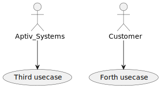

# Requirements
1. Java e.x OpenJDK...
2. VSCode
3. Extensions listed in /.vscode/extensions.json
   You should see a pop up window to automatically download all necesarry extensions.
5. Put correct path to java.exe in /.vscode/settings.json (line 14) 
   if you don't have PATH correctly assignedyet.
6. Remember to ctrl + s .puml files after every modification

# Informations
1. Diagrams are saved to .svg by default buy you can change it in /.vscode/settings.json (line 19)

# Quick Start
Put some info

## Use Case 1

## Use Case 2

## Sequence 1
